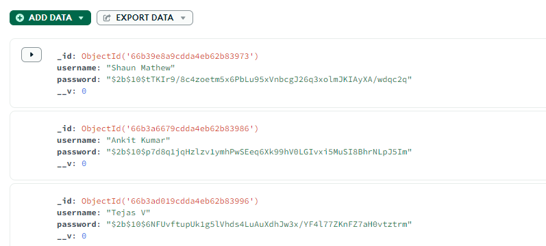

# Xuriti Assessment

This is an Assessment given by xuriti software for the first round.

# Development
## Setup

    1. Clone this gitub repository using the below command.

    git clone https://github.com/Venkatr01/venkat_xuriti.git

    2.Go to frontend folder 

    cd frontend

    3.Install packages with npm

    npm install

    4.Run the frontend folder with this command

    npm run dev

    5.No need to run backend files as it is already deployed on render.com(backend hosting service).

   

    

    
    

    

## Checkout the deployed project live

[Venkat-AssessmentLive](https://venkat-xuriti.vercel.app/)

## About  the project

Project is built using React and Material-UI for frontend.

MongoDB, Express, Node.js, JWT , Bycrypt, mongoose for backend.  

Registration Page and Login page checks whether all the fields are filled when submitted (client side) and if password and confirm password is same.

On successful regisration the user details are posted to backend and user is assigned a JWT token which is stored in their local storage and  are redirected to a dashboard.

The user password is hashed using Bycrypt and stored in mongoDB database.

The dashboard includes a button  and when clicked it sends the users JWT token to the backend and verifies it and upon verifying it sends the registered users data which is then rendered in the frontend.

